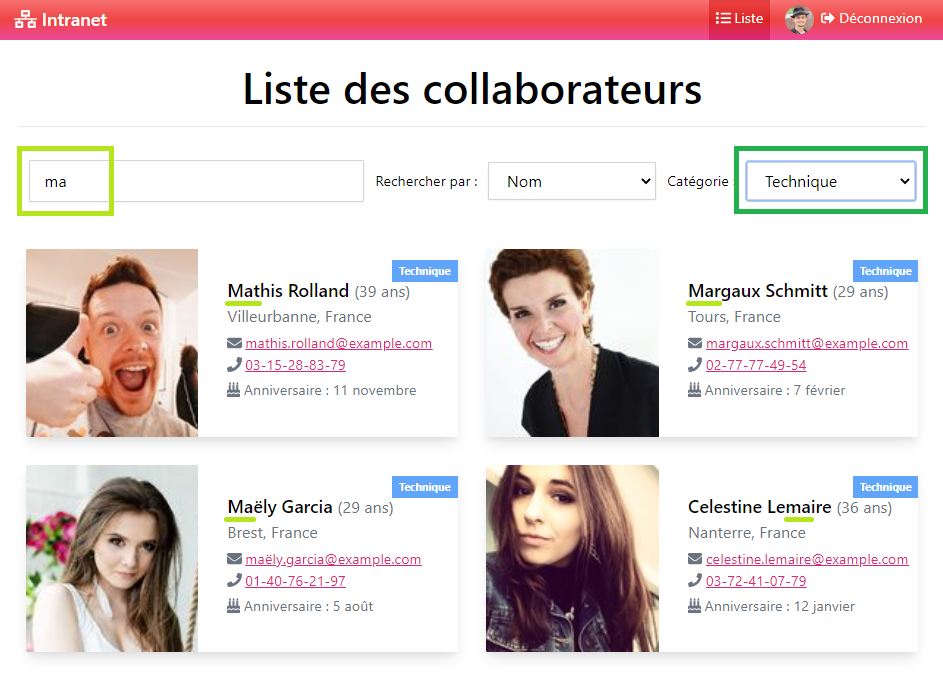

# TP 03

Vous êtes en charge de développer la plateforme Intranet de votre société.

Cette plateforme, accessible uniquement en interne, doit permettre de retrouver des informations sur l'ensemble des collaborateurs.

Pour les CSS, vous êtes libre de proposer votre propre charte graphique. 

Gérez le développement de ce projet par équipe de 2/3, partagez si possibles les différentes fonctionnalités à mettre en place.

## Stack technique

- Front-end : HTML, CSS, React

## Présentation du fonctionnement de la plateforme

### A. Utilisateur standard :

L'utilisateur doit pouvoir se connecter au système via son login et mot de passe, proposez un système pour se connecter/déconnecter.


Une fois connecté, l'utilisateur arrive sur la page d'accueil qui lui présente un de ses collaborateurs au hasard :


*(Facultatif) Le bouton "_Dire bonjour à quelqu'un d'autre_" doit permettre d'afficher un autre collaborateur au hasard.*

L'utilisateur peut via le menu se déplacer sur la page de listing des collaborateurs de la société. Les collaborateurs s'affichent sous forme de card, avec toutes leurs caractéristiques :


Cette page doit également permettre un affichage avec un système de filtres par **nom**, **localisation** et **catégorie** :



La liste doit se rafraîchir instantanément.

L'utilisateur doit également pouvoir accéder à une page de modification de ses informations personnelles (incluant le login/mot de passe) en cliquant sur son image de profil dans le header :


Enfin, l'utilisateur doit pouvoir se déconnecter. Après déconnexion, aucune des pages précédentes (home, listing) ne sont accessibles.

### B. Administrateur :

L'administrateur est un utilisateur standard, disposant de privilèges supplémentaires. Il peut :

- Ajouter un nouveau collaborateur.
- Supprimer un collaborateur existant.

Dans sa barre de menu, il a accès à un lien pour **"Ajouter"** un nouveau collaborateur.

L'affichage d'une card d'un utilisateur lui propose aussi 2 boutons supplémentaires **"Éditer"** et **"Supprimer"** :


La page d'ajout est un simple formulaire pour créer un nouveau collaborateur :


-----

## Data

## Détails des données

Une base d'utilisateurs (data) est déjà fournie avec l'énoncé (fichier `users.json`) afin que vous puissiez commencer à travailler avec des données. N'hésitez pas à consulter et analyser ces informations avant de démarrer.

La structure d'un collaborateur est la suivante :

```
id          -   Identifiant unique du collaborateur (ObjectID ou INT(11))
gender      -   Sexe ("male" ou "female")
firstname   -   Prénom
lastname    -   Nom
email       -   Email pro
password    -   Mot de passe haché avec bcrypt
phone       -   Numéro de la ligne directe
birthdate   -   Date de naissance
city        -   Ville où le collaborateur travaille
country     -   Pays où le collaborateur travaille
photo       -   Une URL valide vers une image en ligne
category    -   Service dans lequel travaille le collaborateur ("Marketing", "Client" ou "Technique")
isAdmin     -   Le collaborateur est un administrateur de la platforme (Boolean)
```

Pour votre information, le set de données fourni propose une liste de 42 utilisateurs. Pour faire vos tests, sachez que le mot de passe haché de chaque utilisateur correspond à la partie avant le `@` de son adresse email. Par exemple, pour l'utilisateur **Owen Lopez** :
```json
{
    …
    "email": "owen.lopez@example.com",
    "password": "$2b$10$IExQBXEZVifvfEOWvWsmO.4.OocNb7zQzurQerwOQh1tZx/3okSp.",
    …$2y$10$CP3kQ.d5muteVzCYWKzsw.GP4B0HtHvirkv9I1Cf1rth8d5xV9u7K
    $2y$10$dLgIY9RG4BoxCsAGnn6Dbe/SEW0Uih5oslpxJnbeoGO5fnqFfB5Gi
}
```

Ce hash correspond à la chaîne `owen.lopez`.

Le seul administrateur du set par défaut est `admin@admin.com` avec le mot de passe `admin`.
